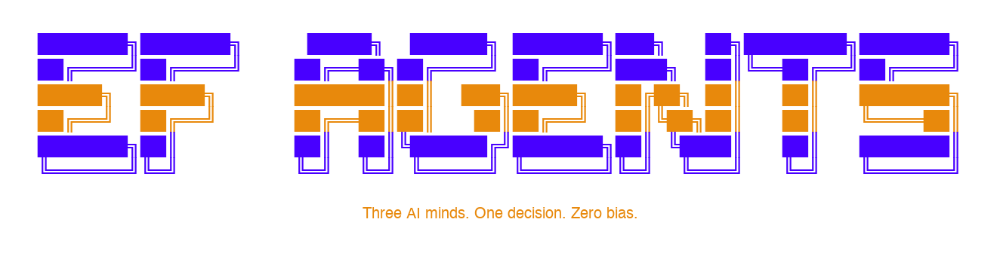

<p align="center">
  
</p>

<p align="center">
  <b>Two AI agents. 100 rounds of debate. One verdict.</b>
</p>

<p align="center">
  <a href="#quick-start">Quick Start</a> &nbsp;·&nbsp;
  <a href="#how-it-works">How It Works</a> &nbsp;·&nbsp;
  <a href="#the-agents">The Agents</a> &nbsp;·&nbsp;
  <a href="#demo">Demo</a>
</p>

---

> **What if founder evaluation had zero human bias?**
>
> EF Agents takes a candidate's LinkedIn, Twitter, and GitHub — feeds them to two opinionated AI analysts — and lets them **argue for 100 rounds** until they reach a verdict. The entire debate streams live in your terminal. The result? An EF-branded PowerPoint memo, ready for the investment committee.

---

## How It Works

```
                    LinkedIn / Twitter / GitHub
                              │
                    ┌─────────┴─────────┐
                    ▼                   ▼
            ┌──────────────┐   ┌──────────────┐
            │    ALISA     │   │     BOB      │
            │              │   │              │
            │ Founder Edge │   │ Taste &      │
            │   Analyst    │   │ Network      │
            │              │   │   Analyst    │
            │  Track Record│   │  Info Diet   │
            │  Domain Exp. │   │  Thought Led.│
            │  Execution   │   │  Network Qlt.│
            │  Market Fit  │   │  Builder Sig.│
            └──────┬───────┘   └──────┬───────┘
                   └────────┬─────────┘
                            ▼
                ┌───────────────────────┐
                │     ROUND TABLE       │
                │                       │
                │  100-Round Debate     │
                │  Real-time Streaming  │
                │  Conviction Tracking  │
                │  Phase Transitions    │
                └───────────┬───────────┘
                            ▼
                ┌───────────────────────┐
                │   EF-STYLE PPT MEMO   │
                │                       │
                │  5 slides, auto-gen   │
                │  Score bars & verdict │
                └───────────────────────┘
```

## The Agents

### Alisa — Founder Edge Analyst

> *"Show me the 0-to-1. Show me the unfair advantage."*

Former YC partner. 5,000+ founders reviewed. She dissects LinkedIn profiles like a surgeon — career trajectory, domain depth, execution velocity, founder-market fit. Skeptical by default. Data-driven. Hard to impress. But when she spots an outlier, she **knows**.

| Dimension | What She Looks For |
|---|---|
| Track Record | Achievements that outperform peer group. 0-to-1 experience. |
| Domain Expertise | Depth in target domain. Unfair knowledge advantages. |
| Execution Signal | Shipping speed. Completion rate. Real-world impact. |
| Founder-Market Fit | Why *this person* for *this problem*? |

### Bob — Taste & Network Analyst

> *"Who you follow reveals more than your resume ever will."*

Former a16z crypto researcher. He reads your Twitter follows before your CV. He checks your GitHub stars before your degree. Sharp intuition, bold opinions. He believes **taste is the ultimate signal** — and he can smell it from a starred repo list.

| Dimension | What He Looks For |
|---|---|
| Information Diet | Quality of sources. Who they follow. What they read. |
| Thought Leadership | Original thinking. Influence. Non-obvious takes. |
| Network Quality | Connection density with top builders and thinkers. |
| Builder Signal | GitHub activity. Side projects. Open-source taste. |

### The Round Table — 100-Round Debate

Alisa and Bob don't just score independently — they **argue**.

| Phase | Rounds | What Happens |
|---|---|---|
| Opening Statements | 1 — 5 | Each agent presents their position |
| Deep Dive & Challenge | 6 — 40 | Cross-examination. Score justification. Evidence wars. |
| Stress Test | 41 — 80 | Devil's advocate. Red flags. Worst-case scenarios. |
| Convergence | 81 — 100 | Find common ground. Negotiate. Final verdict. |

Each round tracks **conviction shifts** in real-time. When an agent changes their mind, you see it happen — with the reasoning.

## Quick Start

```bash
# Clone
git clone https://github.com/troyrocket/ef-agents.git
cd ef-agents

# Install
pip install -r requirements.txt

# Set API key
cp .env.example .env
# Add your Anthropic API key to .env

# Run
python3 main.py \
  --linkedin "https://linkedin.com/in/someone" \
  --twitter "https://x.com/someone" \
  --github "https://github.com/someone"
```

## Demo

No API key? No problem. Full 100-round demo with pre-scripted debate:

```bash
python3 main.py --demo
```

The demo evaluates a sample candidate with realistic agent dialogue, conviction shifts, and generates a complete PPT memo — perfect for seeing the full experience.

## Output: EF-Branded PPT Memo

Auto-generated 5-slide PowerPoint in EF's visual style:

| Slide | Content |
|---|---|
| Cover | Candidate name, verdict, edge type, executive summary |
| Founder Edge | Alisa's 4-dimension scores with visual bars |
| Taste & Network | Bob's 4-dimension scores with visual bars |
| Round Table | Key turning points, conviction shifts, final positions |
| Verdict | Big verdict, consensus status, both agents' summaries |

## Tech Stack

| Component | Technology |
|---|---|
| AI Engine | Claude (Anthropic) |
| CLI Experience | Rich — real-time streaming with color |
| PPT Generation | python-pptx — EF-branded templates |
| Data Collection | Jina Reader + GitHub API |
| Config | python-dotenv |

## EF Edge Framework

At the core of evaluation is EF's **Edge Framework** — the belief that great founders have an unfair advantage:

- **Tech Edge** — Deep technical expertise. Sees possibilities others overlook.
- **Market Edge** — Industry exposure that yields non-obvious insights.
- **Catalyst Edge** — Assembles people, resources, momentum. Moves fast.

Alisa classifies every candidate's Edge type. It's the most important signal.

## Project Structure

```
├── main.py                # CLI entry + demo mode (100 scripted rounds)
├── src/
│   ├── config.py          # Brand colors, agent personas, prompts
│   ├── data_collector.py  # GitHub API + Jina Reader scraping
│   ├── agents.py          # Alisa & Bob independent evaluations
│   ├── round_table.py     # 100-round debate engine with streaming
│   └── ppt_generator.py   # EF-style PPT memo generation
├── requirements.txt
└── .env.example
```

## License

MIT

---

<p align="center">
  <b>Built for the EF Hackathon</b><br>
  <sub>Three AI minds. One decision. Zero bias.</sub>
</p>
